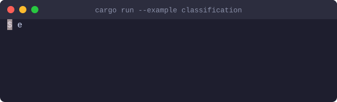
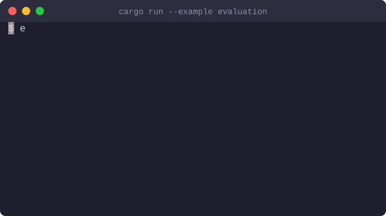

# TypedLM

Typed, testable LLM programs for Rust.

A language model call becomes a function with a typed contract: the input is a
Rust struct, the output is a Rust type, and the answer is validated against it
before your code sees it. The same contract lets you measure the program on a
labelled dataset.

<p align="center">
  
</p>

<p align="center"><sub>A recorded run against a local Ollama, played with
<a href="https://github.com/casoon/castwright">castwright</a>.</sub></p>

```rust
use schemars::JsonSchema;
use serde::{Deserialize, Serialize};
use typedlm::http::OpenAiCompatible;
use typedlm::prelude::*;

#[derive(Debug, Serialize, Deserialize, JsonSchema)]
enum Urgency { Low, Medium, High }

#[derive(Debug, Serialize, Deserialize, JsonSchema)]
enum Category { Billing, Technical, Shipping, Other }

#[derive(Debug, Serialize, Deserialize, JsonSchema)]
struct TicketClassification {
    urgency: Urgency,
    category: Category,
}

/// Classify a customer support ticket by urgency and category.
#[derive(TypedLm, Serialize)]
#[lm(output = TicketClassification)]
struct ClassifyTicket {
    text: String,
}

let classify = Program::<ClassifyTicket, _>::new(OpenAiCompatible::ollama("qwen3:32b"));
let ticket = classify.run("Production database is down since 9:00").await?;

match ticket.urgency {
    Urgency::High => escalate(ticket).await?,
    _ => queue(ticket).await?,
}
```

No prompt to write and no JSON to parse: the doc comment becomes the instruction,
the output type becomes the JSON Schema.

## What it does

- **Typed contract.** `#[derive(TypedLm)]` on the input struct, any
  `Deserialize + JsonSchema` type as output. Doc comments on types and fields reach
  the model.
- **Validation with repair.** The answer is extracted (code fences, surrounding text
  and trailing commas are tolerated), checked against the schema — every violation
  with its path, e.g. `$.items[2].quantity` — and against your own rules
  (`#[lm(validate = fn)]`). Invalid answers go back to the model with that list,
  up to a configurable number of times.
- **Four strategies.** Native structured output, forced tool call, JSON mode or
  prompt only — the strongest one the provider supports is chosen, with the schema
  rewritten for the provider (e.g. OpenAI strict mode).
- **Evaluation.** Datasets in JSON Lines with partial labels, `ExactMatch` and
  `FieldAccuracy`, and a report with a 95 % confidence interval, per-field accuracy,
  repair and failure rates, latency percentiles and token usage.
- **Regression tests.** Store a report as baseline; later runs are compared example by
  example and fail only on a statistically significant drop, naming the examples that
  got worse. Several runs per example show how stable the answers are.
- **Testing without a model.** Fixed answers, closures, schema-valid answers, and
  recording real interactions to replay them offline in `cargo test`.
- **Compiled programs.** Worked examples, instructions and settings stored as a
  reviewable JSON artefact with the evaluation it was accepted on; loading checks it
  against the signature.
- **Command line.** `typedlm-cli` runs programs across several models as a matrix,
  keeps every run as a snapshot and compares runs; the `typedlm` binary shows and
  compares stored reports, with exit codes for CI.
- **Tracing.** One `tracing` span per call with OpenTelemetry GenAI field names.
  Inputs and answers are only recorded on request.

## Providers

`OpenAiCompatible` talks to any OpenAI-compatible chat completions API: OpenAI,
local servers such as Ollama, and routers that translate to other vendors. Other
providers implement the `Provider` trait.

```rust
let openai = OpenAiCompatible::new("https://api.openai.com/v1", "gpt-5-mini").api_key(key);
let local = OpenAiCompatible::ollama("qwen3:32b");
```

Transport errors, `429` and `5xx` are retried with backoff and `Retry-After`;
repairing invalid answers is counted separately.

## Evaluation

```jsonl
{"input": {"text": "Our production database is down."}, "expected": {"urgency": "High", "category": "Technical"}}
{"input": {"text": "I was charged twice this month."}, "expected": {"category": "Billing"}}
```

```rust
let dataset = Dataset::<ClassifyTicket>::from_jsonl("tickets.jsonl")?;
let report = evaluate(&classify, &dataset, &ExactMatch, 4).await;
println!("{report}");
```

<p align="center">
  
</p>

The interval is the point: eight examples say little, and the report shows it.

```rust
// In a test: fails only on a significant drop against the stored run.
Baseline::at("tests/baselines/classify.json").check(&report)?;
```

## Examples

```sh
TYPEDLM_MODEL=qwen3:32b cargo run --example classification
TYPEDLM_MODEL=qwen3:32b cargo run --example extraction
TYPEDLM_MODEL=qwen3:32b cargo run --example evaluation
```

Without `TYPEDLM_API_KEY` the examples use a local Ollama; with it, the OpenAI API
(or `TYPEDLM_BASE_URL`).

## Features

| Feature | Default | Adds |
|---|---|---|
| `derive` | yes | `#[derive(TypedLm)]` |
| `http` | yes | `OpenAiCompatible` (reqwest with rustls, tokio timer) |
| `eval` | yes | datasets, metrics, `evaluate` |

Without default features the crate depends on `serde`, `serde_json`, `schemars` and
`tracing` only, and on no async runtime.

## Status

Early development, not published on crates.io yet. Tested live against Ollama
(qwen3:32b) with all four strategies; OpenAI has not been tested live yet. Not
included yet: prompt optimisation. MSRV 1.85.

## License

MIT
